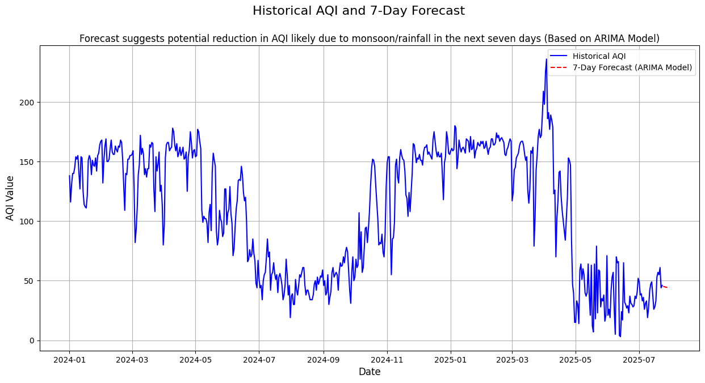

# AQI Forecast for Kathmandu

A time series forecasting project for predicting Air Quality Index (AQI) values in Kathmandu.

---

## Project Overview

This project analyzes historical air quality data and implements time series forecasting models to predict AQI values for the next 7 days. The analysis focuses on understanding seasonal patterns and trends in air pollution across Kathmandu Valley.

---

## Features

- Data processing and cleaning for air quality measurements
- AQI calculation and categorization
- Time series analysis with seasonal decomposition
- Multiple forecasting models (ARIMA, etc.)
- Visualization of trends and forecasts
- Performance evaluation metrics

---

## Installation

```bash
git clone https://github.com/yourusername/aqi-forecasting-nepal.git
cd aqi-forecasting-nepal
pip install -r requirements.txt
```


## Usage

1. **Data Processing**: Run the data processing notebooks to clean and prepare the data
2. **AQI Computation**: Calculate AQI values and categories
3. **Forecasting**: Generate 7-day forecasts using trained models

---


## Project Structure

```
aqi-forecasting-ktm/
├── README.md
├── requirements.txt
├── .gitignore
├── LICENSE
├── data/
│   ├── processed/
│   │   └── ktm_clean.csv
├── notebooks/
│   ├── computing_aqi_and_aqi_category.ipynb
│   ├── creating_yearly_dataset.ipynb
│   └── ts_forecast.ipynb
├── results/
│   └── images/

```
---


## **Summary of Approach and Results:**

This project applied classical time series forecasting methods to predict AQI values for Kathmandu using historical data from January 2024 to July 2025.


- **Data Preparation:** Cleaned and aggregated daily AQI data, handling missing values and duplicates.
- **Analysis:** Identified clear seasonality—lower AQI during the rainy season (June–Sept), higher during the dry season (Jan–Mar).
- **Modeling:** Used ARIMA and Holt-Winters models; ARIMA (order 1,1,1) performed best based on MAE (10.22), RMSE (11.74), and MAPE (31.68%).
- **Forecast:** The final ARIMA model predicts AQI in the "Good" category for July 24–30, 2025.

This demonstrates effective use of time series models for actionable air quality forecasting in Kathmandu.

---

## Visualizations

Below are key visualizations generated during the project:

### AQI category distribution for 2024


### Daily AQI values in Kathmandu (2024–2025)


### Seasonal decomposition of AQI time series


### Partial and autocorrelation plots for model selection


### Residuals and error analysis for ARIMA model


### Comparison of forecasting models (ARIMA, Holt-Winters)


### 7-day AQI forecast (July 24–30, 2025)


### Combined forecast and actuals for the last 7 days


---


## License

This project is licensed under the MIT License - see the LICENSE file for details.

--- 

## Links

[Main Fellowship Repository](https://github.com/KushalRegmi61/AI_Fellowship_FuseMachines)
